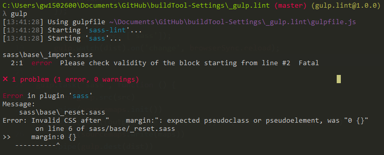

###### Gulp setting

# 1. gulp-sass-lint
### gulp + gulp-sass-lint
- 'gulp-sass-lint'를 사용해 sass파일의 실수를 찾아주는 코드 검사기

#### npm install
```sh
npm install gulp-sass-lint --save-dev
```

#### gulpfile.js
##### 플러그인 호출, 경로 저장
```js
var gulp = require('gulp'),
    sassLint = require('gulp-sass-lint');
```

##### task 작성
```js
gulp.task('default', function () {
    return gulp.src('sass/**/*.s+(a|c)ss')
        .pipe(sassLint())
        .pipe(sassLint.format())
        .pipe(sassLint.failOnError())
});
```

> 결론은 gulp-sass-lint 플러그인을 따로 쓰는것보다 gulp-sass의 error message가 훨씬 좋음


# 2. gulp building
### gulp-concat + gulp-uglify
> gulp-concat: js 파일 병합을 위한 플러그인  
> gulp-uglify: js 파일 압축을 위한 플러그인  
> gulp-jshint: js 코드 검사를 위한 플러그인 [JSHint 옵션](https://blog.outsider.ne.kr/1007)  
> jshint-stylish: JSHint 에러 메세지의 가독성을 높여주는 플러그인

#### npm install
```sh
npm install gulp-concat gulp-uglify gulp-jshint jshint-stylish --save-dev
```

#### gulpfile.js
##### 플러그인 호출, 경로 저장
```js
var gulp = require('gulp'),
    concat = require('gulp-concat'),
    uglify = require('gulp-uglify'),
    jshint = require('gulp-jshint'),
    stylish = require('jshint-stylish');
```

##### task 작성
- sass와 함께 빌드

```js
gulp.task('lint-js', function() {
    gulp.src(SRC.JS)
    .pipe(jshint())
    .pipe(jshint.reporter('jshint-stylish'))
    .pipe(jshint.reporter('fail'));
});

gulp.task('sass', function () {
  return gulp.src(SRC.SCSS)
	.pipe(sourcemaps.init())
    .pipe(sass({outputStyle: 'compact'}).on('error', sass.logError))
	.pipe(sourcemaps.write(DIR.MAP))
    .pipe(gulp.dest(DIR.DEST));
});

gulp.task('js', ['lint-js'], function() {
    gulp.src([SRC.JS, SRC.UTIL])
    .pipe(concat('bundle.js'))
    .pipe(uglify())
	.pipe(gulp.dest(DIR.DEST));
});

// watch
gulp.task('watch', function () {
    gulp.watch(SRC.SCSS, ['sass']);
    gulp.watch(SRC.JS, ['js']);
});
```
